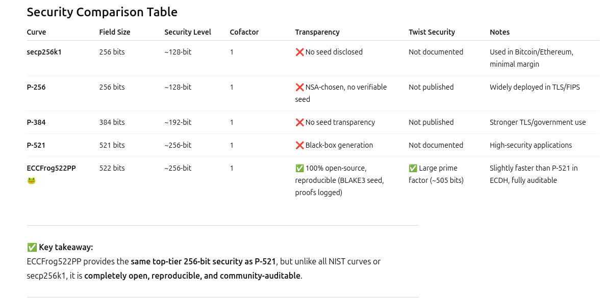
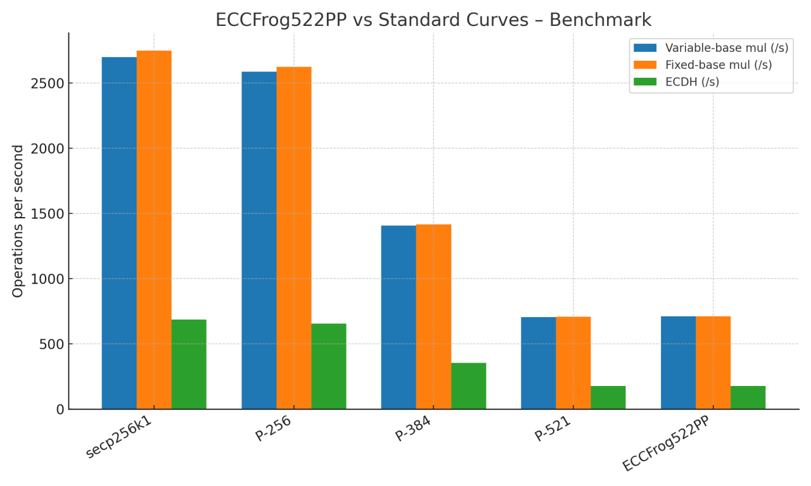
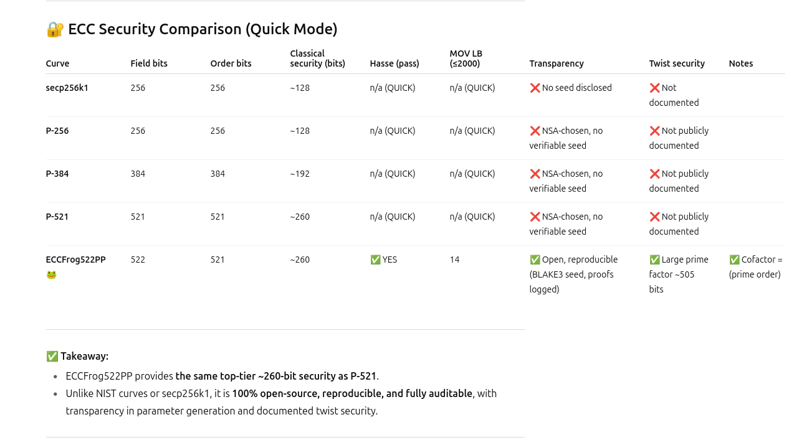

# HippoFrog (ECCFROG522PP) — Twist-Safe ECDH + AES-256-GCM


**Download:** [HippoFrog.zip](https://github.com/victormeloasm/HippoFrog/releases/download/Hippo/HippoFrog.zip)

## Table of Contents

* [1. Story & Motivation](#1-story--motivation)
* [2. High-Level Overview](#2-high-level-overview)
* [3. Cryptographic Design](#3-cryptographic-design)

  * [3.1. Curve: ECCFROG522PP](#31-curve-eccfrog522pp)
  * [3.2. ECDH, HKDF, AES-GCM](#32-ecdh-hkdf-aes-gcm)
  * [3.3. Twist/Invalid-Curve Safeguards](#33-twistinvalid-curve-safeguards)
* [4. File Format Specification](#4-file-format-specification)

  * [4.1. Header Layout (86 bytes)](#41-header-layout-86-bytes)
  * [4.2. Complete Blob Layout](#42-complete-blob-layout)
  * [4.3. AAD & Authenticity Guarantees](#43-aad--authenticity-guarantees)
* [5. Building](#5-building)
* [6. Quick Start](#6-quick-start)
* [7. Command Reference](#7-command-reference)
* [8. Key Management](#8-key-management)
* [9. Safety, Threat Model & Limitations](#9-safety-threat-model--limitations)
* [10. Internals & Code Map](#10-internals--code-map)
* [11. Testing & CI](#11-testing--ci)
* [12. Performance Notes](#12-performance-notes)
* [13. Portability Notes (OpenSSL 3.x)](#13-portability-notes-openssl-3x)
* [14. Full Specification of ECCFrog522PP (Presunto Power)](#14-full-specification-of-eccfrog522pp-presunto-power)
* [15. Contributing](#15-contributing)
* [16. License](#16-license)

---

## 1. Story & Motivation

HippoFrog is an end-to-end educational tool that demonstrates **key exchange (ECDH)**, **key derivation (HKDF-SHA-256)**, and **authenticated encryption (AES-256-GCM)**, while enforcing **twist/invalid-curve defenses**. The curve is **ECCFROG522PP**, a \~522-bit prime-field curve with cofactor 1 and `a = −9`. The project intentionally uses a non-standard curve to keep the focus on correctness and validation.

## 2. High-Level Overview

* Generate an EC keypair on ECCFROG522PP (PEM + compressed public).
* Validate keys (on-curve + subgroup checks).
* Encrypt/decrypt files using **ECDH → HKDF → AES-256-GCM**.
* Self-describing binary format that binds parameters into the AAD.

Minimal deps: **C++20** + **OpenSSL 3.x**.

## 3. Cryptographic Design

### 3.1. Curve: ECCFROG522PP

* **Field:** prime \~522 bits; decimal constants in `include/hf/params.hpp`.
* **Equation:** `y² = x³ + a·x + b (mod p)` with **`a = −9`**.
* **Base point:** `G=(GX,GY)` satisfies the curve equation.
* **Order:** prime `n` with **cofactor `h = 1`** (`n·G = O`).

A compact **parameter hash** binds active curve parameters into each ciphertext:

```
SHA256(P_DEC | "|" | A_INT | "|" | B_DEC | "|" | N_DEC | "|" | GX_DEC | "|" | GY_DEC)
```

### 3.2. ECDH, HKDF, AES-GCM

* **ECDH:** sender uses an **ephemeral** EC key; shared secret = `eph_priv × recipient_pub`.
* **HKDF-SHA-256:** `salt = 32` random bytes; `info = param_hash || "HippoFrog v2.2 AES-256-GCM"`; output key = 32 bytes.
* **AES-256-GCM:** `IV = 12` random bytes; **tag = 16 bytes** appended to the output.

### 3.3. Twist/Invalid-Curve Safeguards

For every public point `Q`:

1. **On-curve:** `EC_POINT_is_on_curve(...) == 1`
2. **Prime-order subgroup:** check **`n·Q = O`** (cofactor 1)
3. **Reject identity** (`Q = O`).

## 4. File Format Specification

### 4.1. Header Layout (86 bytes)

```c
struct __attribute__((packed)) Header {
    char     magic[4];      // "HFv1"
    uint8_t  version;       // 1
    uint8_t  reserved[3];   // zero
    uint8_t  param_hash[32];// SHA-256 of curve params
    uint8_t  salt[32];      // HKDF salt
    uint8_t  iv[12];        // AES-GCM IV
    uint16_t eph_len;       // length of compressed ephemeral pub
};
```

* Size: **86 bytes**.
* **Endianness:** `eph_len` follows host endianness (little-endian on typical x86\_64).

### 4.2. Complete Blob Layout

```
[ Header (86B) ]
[ EphemeralPublicCompressed (eph_len) ]
[ Ciphertext (...) ]
[ GCM Tag (16B) ]
```

### 4.3. AAD & Authenticity Guarantees

**AAD = `Header || EphemeralPublicCompressed`**. Any change to header fields or the ephemeral public invalidates the GCM tag.

## 5. Building

Ubuntu/Debian:

```bash
sudo apt-get update
sudo apt-get install -y build-essential lld pkg-config libssl-dev
make clean && make -j$(nproc)
```

Binary: `bin/HippoFrog`

## 6. Quick Start

```bash
./bin/HippoFrog --generate-keys       # writes keys/priv.pem, keys/pub.pem, keys/pub.comp
./bin/HippoFrog --validate-keys       # on-curve + subgroup checks
echo "hippos love gimonada" > note.txt
./bin/HippoFrog --encrypt note.txt    # produces note.txt.hf
./bin/HippoFrog --decrypt note.txt.hf # recovers plaintext
```

## 7. Command Reference

```
HippoFrog CLI (v2.2)
Usage:
  HippoFrog --generate-keys
  HippoFrog --validate-keys
  HippoFrog --b
  HippoFrog --encrypt <file>
  HippoFrog --decrypt <file.hf>
```

## 8. Key Management

* Distribute `keys/pub.pem` (and optionally `keys/pub.comp`).
* Protect `keys/priv.pem` with OS permissions and backups.
* Rotate via `--generate-keys` and redistribute the public key.

## 9. Safety, Threat Model & Limitations

* Confidentiality + authenticity via AES-256-GCM with AAD = header + ephemeral public.
* Parameter binding via `param_hash`; mismatches abort decrypt.
* **Non-standard curve**: research-only; no public cryptanalysis claimed here.
* `eph_len` endianness is host-dependent (interoperability requires consistency).



## 10. Internals & Code Map

```
include/hf/
  params.hpp        # curve params + param_hash()
  backend.hpp       # backend interface
  crypto.hpp        # HKDF + AES-256-GCM (EVP)
  cmds.hpp          # CLI entrypoints

src/
  backend_openssl.cpp  # group init, point checks, ECDH, compression
  cmds.cpp             # header, AAD, IO, glue-code
  main.cpp             # CLI dispatcher
```

## 11. Testing & CI

A GitHub Actions workflow builds on Ubuntu and runs smoke tests: keygen, validate, encrypt/decrypt.

## 12. Performance Notes

* \~521-bit curve; heavier than 256-bit classes but fine for general CLI use.
* Build uses modern flags and lld when present.



## 13. Portability Notes (OpenSSL 3.x)

* Uses EVP for AES-GCM and HKDF; EC APIs are legacy (warnings silenced). Provider-based refactor is possible later without changing the file format.

---

## 14. Full Specification of ECCFrog522PP (Presunto Power)

### 1. Introduction

* Curve name: **ECCFrog522PP (Presunto Power)**
* Generated: **2025-08-25 UTC**
* Seed: `ECCFrog522PP|v1`
* Method: Deterministic generation via **BLAKE3**, parallelized search on Ryzen 9 5950X (32 cores, 128 GB RAM).

### 2. Field parameters

* Prime p (decimal):
  `6864797660130609714981900799081393217269435300143305409394463459185543183397656052122559640661454554977296311391480858037121987999716643812574028291115058039`
* Prime p (hex):
  `0x20000000000000000000000000000000000000000000000000000000000000000000000000000000000000000000000000000000000000000000000000000000377`
* Bits: **522**

### 3. Curve parameters

* Equation: `y² = x³ − 9x + b mod p`
* a: **−9**
* b (decimal):
  `6611391361841958508604524699377447911389994900129754213077683112250964195093882510934154923371011820554254572559896136823993565633006955666197428760619911`
* b (hex):
  `0x7e3bceccfd45483334adf221158d1db7ff8456d746fe5f8844ce317ed31514d9c323c6adb78c10d36df0fb1111936e1be21d55444c49ace1168053242e5a2b87`
* b index i: **1,294,798**
* j-invariant (hex):
  `0x18439cdd3687bd3f0ad0125a314b06742c759b642c0483cb1aa6370947bd4b8aee06d20e466d306ab5ed2b3a9ca59703d27f09c8cc76c6b61fb3fd5af4f5d1688e5`

### 4. Security checks

* Order N (decimal):
  `6864797660130609714981900799081393217269435300143305409394463459185543183397654707839930998069072437178898634323218419738245117910726080434907495541251156283`
* Bits: **521**
* Cofactor: **1 (N is prime)**
* Trace t:
  `1344282628642592382117798397677068262438298876870088990563377666532749863901757`
* Anti-MOV: **No k ≤ 200** with `p^k ≡ 1 (mod N)`
* CM discriminant:
  `D = t² − 4p = -25652094854852200923182489755562709400813783410907538423881259128294063827498368666061775444493529979367517268977200639940503231230605133844631506932712545107`
* CM small-squarefree check: **PASS up to 100k**

### 5. Twist security

* Twist order (decimal):
  `6864797660130609714981900799081393217269435300143305409394463459185543183397657396405188283253836672775693988459743296335998858088707207190240561040978959797`
* Largest proven prime factor of twist:
  `85873302312087786179581201124346620848743889870570863629357444355031125247340631170553136478826092653027782845595417824845809510622924496694319073328817`
* Large prime bits: **505**

### 6. Embedding degree

* Lower bound LB: **14**
* LB bits: **\~3.81**

### 7. Basepoint generation

* Basepoint G (deterministic from seed):
  `Gx = 11483659870055913964623536371313631260976767098619949198405802655079012131788815900015100098140592301158799072401266653548293144687306675149107389798128134`
  `Gy = 3038694457428442024388132117370677943127343938512113463034318638709600451136325747025138610802391491914091276481105699353919202494902810686593030172286395020`
* Basepoint index j: **0 (astonishing luck)**
* `Order(G) = N`

### 8. Reproducibility instructions

* `b = BLAKE3(seed|b|i) mod p`; choose the first `b` that is prime and non-singular.
* `G = BLAKE3(seed|G|j) mod p`; choose the first point of order `N`.
* Final proofs: ECPP for `b`, `N`, and the large prime factor of `#twist`.
* Software: **SageMath + BLAKE3**.

### 9. System and timing info

* Platform: **Linux-6.14.0-28-generic-x86\_64**
* CPU: **AMD Ryzen 9 5950X (32 logical cores)**
* RAM: **130.4 GB**
* Runtime: **\~216,000 seconds (\~60h)**
* Parallelism: `processes=32, batch=2048, chunksize=32, ctx=spawn`

### 10. Appendix

* SHA256(report):
  `e3b0c44298fc1c149afbf4c8996fb92427ae41e4649b934ca495991b7852b855`
* BLAKE3(report):
  `af1349b9f5f9a1a6a0404dea36dcc9499bcb25c9adc112b7cc9a93cae41f3262`

**Security summary:**

* \~260-bit classical security (similar ballpark to NIST P-521)
* **Cofactor = 1**
* **Twist security > 500 bits**
* **Embedding degree safe**
* Fully reproducible generation, no hidden parameters
* Rare: \~1 in millions of candidates yields a curve this “clean”



---

## 15. Contributing

Contributions welcome. Use `clang-format`, prefer Conventional Commits, and never include secrets in issues/PRs.

## 16. License

MIT © Víctor Duarte Melo
